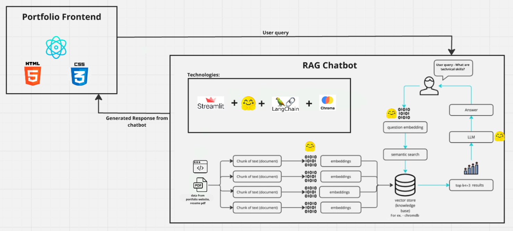

# Portfolio Web Application with Integrated RAG Chatbot

### Team Members:
- **Anmol Valecha** (NUID: 002813410)
- **Kaushikee Bhawsar** (NUID: 002704590)

---

## Links

- **YouTube Demo:** [Watch the demo](https://youtu.be/NVH36Bs7c6o)
- **Project Documents:** Project proposal, Final Project Presentation, and Final Report are available in the GitHub repository.

### Portfolio Links:
- **[Anmol's Portfolio](#)**
- **[Kaushikee's Portfolio](#)**

---

## Branches

- **Branch: `main`:**
  - `Portfolio Web Application with RAG Chatbot.pdf`
  - `Portfolio with RAG Chatbot Report.pdf`
  - `Project_Architecture.png`

- **Branch: `master`:**
  - Contains the code for `Anmol_ResumeBot`

- **Branch: `frontend`:**
  - Contains the code for the frontend of the portfolio website

---

## Project Overview

This project is a comprehensive portfolio website that showcases personal skills, projects, and achievements. It is designed with a modern, responsive frontend and a robust backend, integrated with an AI-powered chatbot using Retrieval-Augmented Generation (RAG). The chatbot allows users to submit natural language queries about the portfolio owner's profile, providing an interactive and engaging experience.

### Features

- **Responsive Portfolio Website:** Built with React, HTML, and CSS.
- **AI-powered RAG Chatbot:** Integrated using Streamlit, Hugging Face transformers, and Pinecone/Chroma for vector storage.
- **Easy Setup:** Instructions for cloning and running the project locally.

### Project Architecture
 <!-- Replace with the actual path to your image -->

---

## Prerequisites

Before you begin, ensure you have the following installed on your system:

- **Node.js** (v14.x or later)
- **npm**
- **Python** (v3.7 or later)
- **pip** (Python package installer)

---

## Setup Instructions

### Clone the Repository
```bash
git clone https://github.com/valecha-a/PORTFOLIO_BOT.git
cd FinalProject
Setup and Run the React App

	1.	Install Dependencies:
Navigate to the frontend directory and install the necessary dependencies:
cd frontend
npm install

2.	Start the React App:
Once the dependencies are installed, start the React app:
npm start

This command will run the app in development mode. Open http://localhost:3000 to view it in the browser.

Setup and Run the Chatbot

	1.	Install Python Dependencies:
Navigate to the chatbot directory and install the required Python packages:
cd ../AnmolResumeBot
pip install -r requirements.txt

	2.	Create Vector Embeddings:
Once the dependencies are installed, generate vector embeddings by running the following command:
python vector_embeddings.py

3.	Run the Chatbot App:
After generating and storing the embeddings, run the following command:
streamlit run ResumeBot.py

The chatbot will be accessible at http://localhost:8501. You can interact with it by submitting natural language queries.

Project Structure

	•	frontend/: Contains the React application for the portfolio website.
	•	AnmolResumeBot/: Contains the Streamlit application and all necessary files for the RAG chatbot.

License

This project is licensed under the MIT License. See the LICENSE file for more details.

Contact

	•	GitHub: valecha-a
	•	Email: valecha.a@northeastern.edu
	•	LinkedIn: Anmol Valecha
